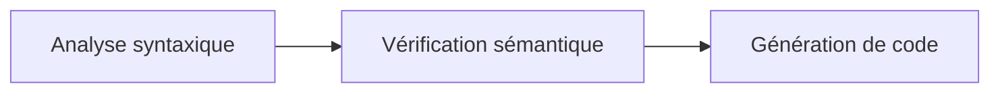

# Conception du compilateur

À haut niveau, le compilateur prend entrée du code Deca, le valide, et produit le cas échéant un fichier assembleur pour l'interpréteur IMA.

[JavaDoc disponible](https://abderrahmenlamloumi.github.io/Deca-Compiler-Java/javadoc/index.html)

## Diagramme de classe

[Ouvrir dans une nouvelle fenêtre](https://abderrahmenlamloumi.github.io/Deca-Compiler-Java/img/deca.png)


## Composants

Pour ceci, le compilateur suit trois grandes étapes :

- La première est l'analyse syntaxique. Surnommée "étape A", elle exécute le lexer et le parseur ANTLR sur le code de l'utilisateur. Un arbre de syntaxe abstraite (*AST*) est ainsi construit. Il représente l'imbrication des blocs Deca.
- Si le code est syntaxiquement correct, sa sémantique est vérifiée. On entend par là prévenir de certains types d'erreurs à l'exécution en s'assurant de la cohérence générale du programme.
- Une fois le programme vérifié, il est transcrit en langage assembleur attendu par IMA.



## LazyBlock

Les LazyBlock sont une classe Java qui nous permet de coder un boût de programme IMA sans le placer dans la liste chainée du compilateur, mais de connaitre le label qui arrive sur ce block.

Ultérieurement, les LazyBlock sont appelés via leur méthode `codeGen` qui vient ajouter leur code à la liste d'instruction du compilateur.

Cette classe est utilisée pour les erreurs à l'exécution et certaines méthodes globales.

## VirtualStack

L'un des besoins les plus récurrents des générateurs de code concerne l'affectation des registres.
Chaque nœud de l'AST génère des instructions opérant sur des registres et doit être en mesure de savoir dans quels registres ses fils génèrent du code.
Pour permettre au compilateur de tracer le moment où un générateur de code réserve un registre et le moment où il le libère, nous avons centralisé la gestion des registres dans la classe `VirtualStack`.

Ce système de pile virtuelle fournit un registre à tout générateur de code qui le demande.
Cette classe attribue des registres tant qu'il en reste à disposition, et s'occupe de libérer temporairement un registre s'il n'y en a plus à disposition.

### Gestion des registres

Le nom de la classe "pile virtuelle" vient du fait que les premières valeurs sont "empilés" sur des registres puis sur la pile en cas de débordement.
Ainsi les 14 registres non-scratch sont privilégiés avant d'écrire dans une zone mémoire plus lente.

Nous avons opté pour une approche proche du Destination-Driven Code Generation[^1] où le générateur de code prend en paramètre le registre où placer le résultat de l'expression.
Nous limitons les déplacements mémoires grâce à ce fonctionnement.

[^1]: [Destination-Driven Code Generation, 1990](https://legacy.cs.indiana.edu/~dyb/pubs/ddcg.pdf)

### Représentation

Nous représentons la propriété exclusive d'un registre avec la classe `Destination`.
Elle correspond à un [new-type](https://doc.rust-lang.org/rust-by-example/generics/new_types.html).
Une nouvelle classe est utilisée, car elle indique clairement qu'une valeur doit être placée par le générateur de code dans ce registre.

De plus, cette classe a un constructeur privé : seule la classe responsable des destinations peut créer des `Destination`.
Cela nous assure que tant qu'aucun code n'accède à un registre non-scratch de lui-même, `VirtualStack` connaît tous les registres actuellement utilisés.

`VirtualStack` fournit la primitive d'allocation des registres via une lambda Java.
Cela nous permet d'exploiter la pile d'appels Java comme un moyen de savoir sur quel intervalle le registre est alloué.
En effet, cette forme d'API en callback permet d'insérer du code avant et après.

```java
compiler.stack.scoped((Destination dest) -> {
    // À partir d'ici, "dest" est réservé à cette expression
    // Dans le cas où la classe VirtualStack a dû libérer un registre,
    // elle a déjà sauvegardé la valeur précédente avec une instruction PUSH.
    getRightOperand().codeGenExpr(compiler, dest);
    // À la fin de cette lambda, "dest" est libéré.
    // Si on a dû précédemment libérer un registre, alors sa valeur précédente
    // est restaurée.
});
```

### Gestion des débordements de pile

`VirtualStack` connaît les `PUSH` et les `POP` qu'elle utilise pour libérer des registres.
Nous lui transmettons également les `ADDSP` et `BSR` faits dans les autres parties du code.
Cette classe peut alors suivre le maximum utilisé de la pile et ainsi calculer `TSTO` automatiquement.

### Sauvegarde des registres 

La class `VirtualStack` est en capacité de nous indiquer les registres utilisés par une méthode après son exécution.

On va donc utiliser cet indicateur pour sauvegarder les registres et les restaurer.
À la génération du code, on va conserver la taille de la liste chainée des instructions IMA du programme, cette valeur correspond à l'index où il faudra placer la sauvegarde des registres.
À la fin de la génération de code de la méthode, on sait combien de registres sont utilisés. On peut donc ajouter les instructions `PUSH` à l'emplacement de notre sauvegarde et les instructions `POP` à la fin de la méthode.

On change également le comportement de l'instruction Déca `return` pour qu'à la place d'appeler l'instruction IMA `RTS` on réalise un branchement vers la restauration des registres qui elle implémente l'instruction `RTS`.

## Label de saut

L'algorithme de destination driven code generation propose un codage des conditions comme des opérations sur le flot de contrôle.
Ainsi la classe `ControlDestination` donne l'information aux générateurs de code qu'ils sont appelés pour un saut et peuvent ainsi améliorer la forme du code généré.
Si le générateur de code n'est pas spécialisé, son implémentation par défaut est d'appeler le générateur de code dans le cas général et de faire un branchement en fonction de la valeur du booléen dans `Destination`.

## Générateur de labels

La classe `BlockLabeller` est responsable d'uniformiser les labels générés.
Le compilateur a besoin de différents labels pour générer des sauts. Pour cela, il a besoin de labels uniques.
Ils seraient refusés par IMA sinon. Pour les rendre uniques, nous les suffixons d'un nombre incrémenté à chaque appel.
Ce système nous permet de conserver le nom "if", "while" propre au label, et ainsi de lire plus facilement le code généré.

Nous avons noté que les identifiants Deca sont sensibles à la casse, tandis que les labels IMA ne le sont pas.
Ainsi pour les labels générés à partir d'identifiants Deca comme les noms de méthodes, nous retirons les caractères invalides pour IMA.
Pour éviter d'avoir un suffixe incrémental, notre approche a été ici de retenir tous les labels générés dans une TreeMap Java.
Elle nous permet de savoir si un label a déjà été utilisé (vérification insensible à la casse) et de ne suffixer les doublons que lorsque nécessaire.

## Gestion des classes et des objets

### Déclaration des classes

La déclaration des classes peut être source de nombreux problèmes. Nous utilisons ici une méthode en trois étapes pour 
palier les problème d'une gestion naïve. 

#### 3 étapes:

- La première consiste en la collecte des noms de l'ensemble des classes.
  
- La seconde est la déclaration des attributs. Nous initialisons ici chaque attribut à sa valeur par défaut :
  *0* pour *int* ou *null* pour les objets
- La troisième est la véritable initialisation comme attendue et spécifiée par l'utilisateur dans le programme.
    Cette initialisation se fait alors dans l'ordre de l'écriture.


Cela nous permet par exemple l'initialisation de *x* à *y* avant même la déclaration de *y*.
Ici, *x* prendra alors la valeur par défaut de *y*.

Pour effectuer une gestion dynamique des appels de méthode, nous stockons dans l'espace mémoire de l'objet sa classe effective.
(*ie Le compilateur connait un type, mais l'objet peut être instance d'une classe plus précise.*)
Cela se matérialise sous la forme d'une adresse vers la VTable de cette classe. 

#### Table des méthodes (VTable)

Son but est de contenir les labels des méthodes. Nous pouvons y accéder grâce à un index propre à la signature de la méthode.
Son principal atout est la simplification de l'héritage. Nous y stockons aussi en en-tête l'adresse vers la table du parent et vers une méthode *equals*

Lors d'un héritage, la Vtable de la nouvelle classe est une copie de celle du parent. Lors de la définition de méthode dans la nouvelle classe, il y a deux cas :
- Soit il s'agit d'une redéfinition : Une méthode surchargée possède la même signature et donc le même index dans la vtable que la méthode du parent. Le label est simplement écrasé par un nouveau vers la surcharge.
- Soit il s'agit d'une nouvelle méthode : Elle est ajoutée à la fin de la table.

### Cast et Instanceof

Le calcul du booléen renvoyé par instanceof est réalisé à l'exécution.
Le type réel d'un objet est connu dans l'en-tête de sa zone mémoire plus que par le compilateur. Le principe d'un instanceof est de savoir si l'objet (opérande de gauche) est lui-même égal ou possède un parent égale à la classe opérande de droite. 
Pour cela, une boucle est exécutée pour remonter les parents de l'opérande de gauche à la VTable.
Le booléen est renvoyé lorsque l'égalité est trouvé ou lorsque l'adresse du dernier parent est *null* (adresse du parent de Object).

Le cast peut être abordé en plusieurs catégories :
- Le cast entre types primitifs : Conversion de *float* vers *int*, ou *int* vers *float*. Celui-ci est assez trivial, une instruction existe pour ce transtypage.
Un cas particulier doit cependant être géré. Lors d'un cast de *float* vers *int*, il faut prendre en compte les valeurs minimal et maximal du type *int*.
- Le cast explicite pour un cast d'un type vers ce même type. (ex: `(boolean)(true);`)
- Le cast entre classe hérité est le plus problématique. Ici encore se distinguent deux cas
  - le cast d'une classe vers un de ces parents 
  - Inversement, le cast d'une classe vers une classe plus basse dans l'héritage est complexe. Ce *downcast* demande une vérification lors de l'exécution.
    Pour cela, nous admettons à la compilation que le cast est possible. Cependant, une vérification est générée dans le code assembleur pour s'assurer que ce cast était effectivement valide.
  La vérification est similaire à l'algorithme de l'instanceof qui correspond très bien à la vérification d'un cast. Cela déplace donc le message d'erreur de la compilation à l'exécution.


### Object

La classe Object est parent implicite de toutes les classes, elle permet d'utiliser la méthode `equals`.

L'implémentation de cette méthode est définie dans `CodeGenProcedures` avec un `LazyBlock` et compare uniquement si les adresses mémoires sont identiques.

## Gestion des erreurs à l'exécution

Certains programmes Deca sont susceptibles de lever des erreurs à l'exécution.
Un programme Deca n'a toutefois rarement besoin de générer le code de tous les gestionnaires d'erreurs possibles.

C'est dans l'objectif de facilement avoir accès aux labels de gestion d'erreurs et de ne les générer que si nécessaire que la classe `CodeGenProcedures` a été créée.
Elle contient une liste de `LazyBlock`, qui sont des blocs de code qui ne sont générés que si le programme y accède lors de la génération de code.


## Testeur automatisé

Le compilateur est accompagné d'un testeur automatisé écrit en Java qui permet de vérifier la validité des programmes Deca.

La classe `DecaTester` est le point d'entrée de ce testeur, qui vient parcourir le répertoire de tests et les classer automatiquement.
Un `DecaTest` est la description d'un test découvert par le scanner de tests `DecaTestScanner`.

Nous avons également créé un `PrologueParser` qui permet de lire les commentaires des fichiers de tests afin d'extraire des informations supplémentaires sur les conditions du test.

