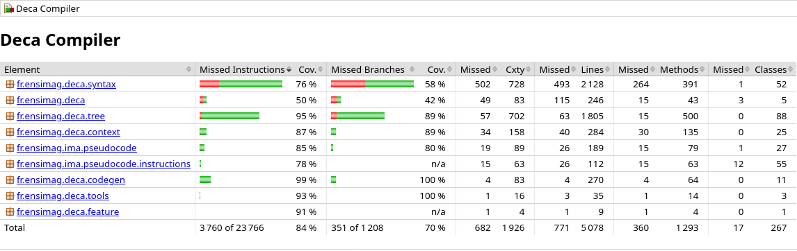
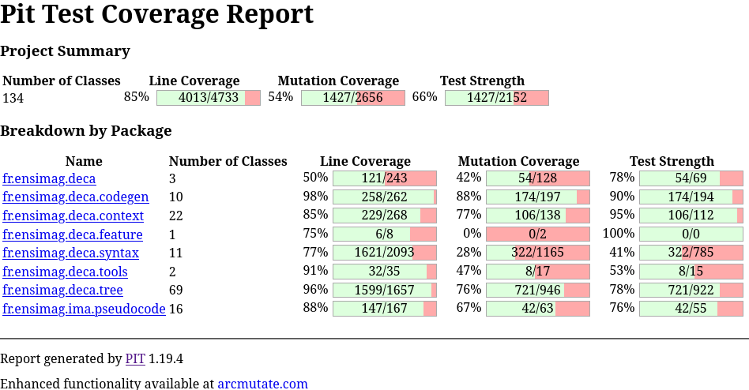

# Tests de validation

## Enjeux

Un compilateur Deca doit être en mesure d'analyser n'importe quel programme Deca. Cela implique que le compilateur doit savoir :

- Détecter les erreurs de syntaxe.
- Détecter les erreurs de vérification contextuelle (types, portée, etc.).
- Générer dans la mesure du possible un code IMA valide, en abstrayant les contraintes du langage d'assemblage.

D'un autre côté, l'implémentation elle-même d'un compilateur est susceptible de contenir des erreurs, avec différents niveaux de gravité :

- *Divergence* : Le compilateur produit un code différent de celui attendu, mais qui reste valide.
- *ICE* (Internal Compiler Error) : Erreur interne, le compilateur plante avec une exception non prévue.
- *UB* (Undefined Behavior) : Le compilateur produit un code imprévisible à l'exécution.

Pour garantir la qualité du compilateur, il est essentiel de prendre en compte tous ces aspects.
Les tester continuellement permet de s'assurer que le compilateur fonctionne comme prévu et de détecter rapidement les régressions.

Puisqu'il existe un nombre considérable de cas que le compilateur doit gérer, nous avons très rapidement cherché à automatiser au maximum les tests de validation de notre compilateur.

Nos critères d'automatisation des tests sont les suivants :

- Ils doivent pouvoir être exécutés de manière isolée, répétée et systématique, en local comme dans un environnement d'intégration continue.
- Les résultats doivent être clairs et faciles à interpréter.
- Ils doivent s'exécuter en un temps raisonnable, pour ne pas ralentir le développement.
- Ils doivent facilement s'intégrer dans les environnements de chaque développeur et avec des outils extérieurs.

## Critères de validation

Selon les enjeux décrits ci-dessus, nous avons défini les éléments à asserter :

- Erreur de syntaxe ou de sémantique : Pour une entrée donnée, le compilateur doit produire une erreur avec une position dans le fichier et un message d'erreur conforme à ce qui est attendu.
- Code valide, exécution réussie : Pour un code source valide, le compilateur doit produire un code IMA qui s'exécute correctement et qui produise une sortie conforme à ce qui est attendu.
- Code valide, exécution échouée : Pour les erreurs à l'exécution (par exemple, division par zéro), le compilateur doit produire un code IMA qui échoue de manière contrôlée, avec un message d'erreur conforme à ce qui est attendu.

À ces critères d'acception, nous ajoutons les besoins de flexibilité suivants :

- Certains tests nécessitent une saisie utilisateur (par exemple, via `readInt()`, `readFloat()`). Il est nécessaire de pouvoir automatiser ces tests en redirigeant l'entrée standard.
- Certains tests ont besoin d'options spécifiques du compilateur ou d'IMA (par exemple pour contrôler la taille de la pile). Il est nécessaire de pouvoir spécifier ces options lors de l'exécution de ces tests.

## Framework de tests

Pour répondre à ces besoins, nous avons développé un framework de tests basé sur JUnit 5.
Il permet d'écrire des tests fonctionnels du compilateur à partir de fichiers `.deca`.
L'exécuteur de tests va automatiquement explorer les répertoires de tests et détecter tous les fichiers `.deca`.
Il les compile avec le compilateur Deca, puis va éventuellement exécuter le code IMA généré.
Il compare ensuite la sortie générée avec le fichier `.expected` associé, et valide les tests le cas échéant.

Le point d'entrée de l'exécuteur de tests est la classe `src/test/java/fr/ensimag/deca/functional/CompilerTest.java`, qui peut être exécutée directement depuis un IDE.
Toutefois, pour avoir une vue d'ensemble des tests, il est recommandé d'exécuter `mvn test` depuis la racine du projet, ce qui lancera l'intégralité des tests, y compris les tests secondaires et unitaires.

### Organisation des fichiers

L'exécuteur de tests détermine automatiquement le type de chaque test en fonction leur emplacement dans l'arborescence.
Les tests sont classés dans des répertoires spécifiques selon leur type :

- `src/test/deca/syntax` : Tests de syntaxe.
- `src/test/deca/context` : Tests de vérification contextuelle.
- `src/test/deca/codegen` : Tests de génération et d'exécution de code IMA.

Le nom du répertoire immédiatement après le type de test détermine l'issue attendue du compilateur ou de l'exécution d'IMA :

- `valid` : Le compilateur ou IMA doit réussir sans erreur.
- `invalid` : Le compilateur ou IMA doit échouer avec une erreur.

Dans le cas des tests nécessitant une saisie utilisateur ou des options spécifiques, ils sont placés dans un répertoire `interactive`, lui-même subdivisé en `valid` et `invalid`.

### Structure d’un test

Un test inclut forcément deux fichiers de même nom, mais avec des extensions différentes :

- Un fichier `.deca` : code source du programme de test
- Un fichier `.expected` : sortie attendue du compilateur ou de l'exécution du code IMA

Par exemple, le fichier `src/test/deca/codegen/valid/hello.deca` pourrait contenir le code suivant :
```
{
    println("HELLO WORLD !!")
}
```

Il serait alors accompagné du fichier `src/test/deca/codegen/valid/hello.expected` avec le contenu suivant :
```
HELLO WORLD !!
```

L'exécuteur de tests reconnaît également les paramètres optionnels suivants :

- Un fichier `.in` : les entrées à fournir au programme lors de son exécution.
- Un commentaire `// compiler-options: <options>` placé au début du fichier `.deca` : les options à passer au compilateur lors de la compilation du programme.
- Un commentaire `// runtime-options: <options>` placé au début du fichier `.deca` : les options à passer à IMA lors de l'exécution du code généré.

:::warning[Attention]
Du fait que les tests doivent pouvoir être exécutés par le testeur et le compilateur enseignant, seuls les tests placés dans les répertoires `interactive` (donc non testés par le validateur enseignant) peuvent contenir des entrées utilisateur ou des options spécifiques.
:::

## Méthodologie de test

Un bon test doit être minimal pour déclencher un comportement spécifique du compilateur.
Il doit être sans ambiguïté sur ce qu'il teste en ayant un nom de fichier explicite.

Nous recommandons de nommer les fichiers de tests avec un ou deux mots-clés décrivant le comportement testé, et de les placer dans une sous-catégorie de tests.
Un exemple de bon nommage de test est `src/test/deca/codegen/valid/assign/rightAssociative.deca`.
Ce fichier teste l'affectation (répertoire `assign`) avec des expressions associatives à droite (`rightAssociative.deca`), et est placé dans le répertoire `valid` car il est censé réussir.

Un bon test doit produire une sortie identifiant clairement que le comportement attendu a été déclenché.
Par exemple, un test d'assignation devrait prouver que la valeur a bien changé après l'affectation. Cela peut être fait en affichant la valeur après l'affectation :

```
{
    int x = 5;
    x = 10;
    println(x); // Doit afficher 10
}
```

Pour qu'une fonctionnalité soit efficacement testée, il est souvent nécessaire de créer plusieurs tests pour couvrir différents cas.
Dans les cas d'échec comme de succès, il est essentiel de maximiser la couverture des cas possibles en testant toutes les combinaisons possibles.
L'[utilisation de Jacoco](#couverture-de-code) pour mesurer la couverture de code peut aider à identifier les combinaisons manquantes à tester.

Outre les cas d'échec et de succès, il est important de tester les cas limites et les comportements particuliers.
Par exemple, le test d'un appel de méthode doit vérifier non seulement que l'appel fonctionne, mais que l'ordre d'évaluation des arguments est correct, et que les effets de bord sont respectés :

```
class Calculator {
    int add(int a, int b) {
        return a + b;
    }
}

{
    int x = 5;
    int y = 13;
    println(new Calculator().add((y = x + 1), (x = y * 2))); // 18
    println(x, " ", y); // 12 6
}
```

Il est également intéressant de varier le format des tests pour couvrir différents aspects du compilateur.
Un bon exercice est d'alterner entre des tests de code proche de ce qu'un utilisateur pourrait concrètement écrire, c'est-à-dire avec un entremêlement d'instructions de différents types, et des tests plus abstraits ou absurdes qui se concentrent sur une spécificité du langage.
Par exemple, on pourrait écrire le test suivant comme un utilisateur pourrait l'écrire :

```
class Math {
    int fastExp(int x, int n) {
        if (n == 0) {
            return 1;
        } else if (n % 2 == 0) {
            return fastExp(x * x, n / 2);
        } else {
            return x * fastExp(x * x, (n - 1) / 2);
        }
    }
}

{
    Math m = new Math();
    println(m.fastExp(5, 0)); // 1
    println(m.fastExp(2, 10)); // 1024
    println(m.fastExp(3, 5)); // 243
    println(m.fastExp(5, 3)); // 125
}
```

Un test d'un cas dit absurde pourrait se concentrer sur la capacité du compilateur à émettre du code dans des positions peu courantes comme :

```
class Foo {
    void bar() {
        bar; // Comment émettre une méthode non appelée ?
    }
}

{
    Foo f = new Foo();
    f.bar();
}
```

## Tests additionnels

La collection de tests fonctionnels ne sert pas uniquement à valider la compilation, mais aussi à vérifier des éléments annexes du compilateur.
L'exemple le plus notable est que l'intégralité des tests fonctionnels sont réutilisés dans un test de décompilation.

L'intérêt de cette approche est de valider que l'option `-p` du compilateur fonctionne correctement à faible coût grâce à la non-duplication des tests.
`DecompileTest` va vérifier que le code décompilé est re-parsable par le compilateur, et que la décompilation d'un code décompilé produit le même code source (test d'idempotence).

## Outils complémentaires

### Couverture de code

[Jacoco](https://www.jacoco.org/) est configuré sur le projet pour mesurer la couverture de code des tests.
La couverture de test consiste en un rapport qui indique quelles lignes de code ont été exécutées lors des tests, et quelles lignes n'ont pas été atteintes.
Pour l'utiliser, il suffit d'exécuter `mvn verify -Djacoco.skip=false` et de consulter le rapport généré dans `target/site/jacoco/index.html`.



Chaque fichier de test doit contribuer à la couverture de code, et le maximum de lignes doivent être surlignées en vert, c'est-à-dire déclenchées, dans le rapport Jacoco.
Une attention particulière doit être portée à la couverture des branches, autrement dit, chaque chemin conditionnel doit être testé.

Le seuil de couverture de code pour l'ensemble du projet est fixé à 80% et 70% de couverture des branches.
Ce seuil est peu significatif, puisque ce qui nous intéresse est la couverture des vérifications contextuelles et des instructions de génération de code.
Et pour ces parties, aucune ligne de code et branchement ne doit rester non testée.
Tout ajout de code dans ses parties doit être accompagné de tests adéquats, que ce soit pour les cas de succès ou d'échec.

Une bonne pratique consiste à, de temps en temps, vérifier la couverture de code et d'identifier les parties du code qui ne sont pas encore couvertes par les tests.
La connaissance de ces zones non testées permet de concentrer les efforts pour les rendre testées.
Si une portion de code semble inaccessible par un test, il faut se demander si elle est vraiment nécessaire, ou si elle peut être simplifiée ou supprimée.
Nous rappelons que s'il y a modification de code existant, il est primordial de vérifier que les tests passent toujours, et que des outils comme le [fuzzer](#fuzzing) confirment qu'il n'existe en effet aucune entrée du compilateur qui pourrait déclencher ce code.

### Tests de mutation

La couverture de code est un bon indicateur de la qualité des tests, mais elle ne garantit pas que les tests sont efficaces.
En effet, rien ne garantit que les tests passent bien grâce au code du compilateur et non par chance.

Pour contrer cela, nous avons mis en place des tests de mutation avec [Pitest](https://pitest.org/).
Dans les grandes lignes, les tests de mutation consistent à modifier le code du compilateur pour introduire des erreurs, puis à vérifier que les tests échouent comme prévu en raison de ces changements.

Ces tests sont exécutés avec la commande suivante :
```bash
mvn test-compile org.pitest:pitest-maven:mutationCoverage
```
Le résultat des tests de mutation est disponible dans le répertoire `target/pit-reports`.
Noter que les tests de mutation sont coûteux en temps d'exécution (de l'ordre d'une dizaine de minutes).

Une base de tests efficace doit fournir un rapport de tests de mutation équivalent au rapport de couverture de code Jacoco, c'est-à-dire que le rapport de tests de mutation doit indiquer que la majorité des mutations doivent avoir été détectées par les tests.



### Fuzzing

Le fuzzing est une technique de test qui consiste à envoyer des entrées aléatoires ou semi-aléatoires à un programme pour détecter des comportements inattendus ou des plantages.

Pour le compilateur Deca, nous avons mis en place un système de fuzzing basé sur [libFuzzer](https://llvm.org/docs/LibFuzzer.html) de LLVM.
libFuzzer est interfacé en Java via [Jazzer](https://github.com/CodeIntelligenceTesting/jazzer).

Pour lancer une session de fuzzing, il suffit d'exécuter les tests avec la variable d'environnement `JAZZER_FUZZ` définie à `1` :

```bash
JAZZER_FUZZ=1 mvn test
```

Noter que le fuzzing est par définition non déterministe et qu'il génère indéfiniment des entrées aléatoires.
Il n'y a donc pas de fin du processus de fuzzing. Plus du temps est laissé au fuzzer, plus il a de chances de trouver des erreurs.

En l'état, le fuzzing est principalement utilisé pour détecter des erreurs internes du compilateur (ICE). En particulier, le fuzzer ne vérifie pas la validité du code généré.
Son utilisation est donc complémentaire aux tests de validation écrits à la main, car son unique objectif est de produire des entrées auxquelles les tests n'auraient pas pensé.

Il convient d'exécuter le fuzzer sur plusieurs minutes et en alternant les corpus initiaux pour maximiser la probabilité de trouver des erreurs.
Si le fuzzer trouve une erreur, il écrit l'entrée qui a causé l'erreur dans un fichier dans le répertoire `src/test/resources/fr/ensimag/deca/fuzz/CompileFuzzTestInputs/compile`.
Une analyse manuelle de cette entrée est nécessaire pour déterminer si elle est pertinente.
Si elle l'est, il est recommandé de l'ajouter à la suite de tests pour éviter que l'erreur ne se reproduise à l'avenir.
